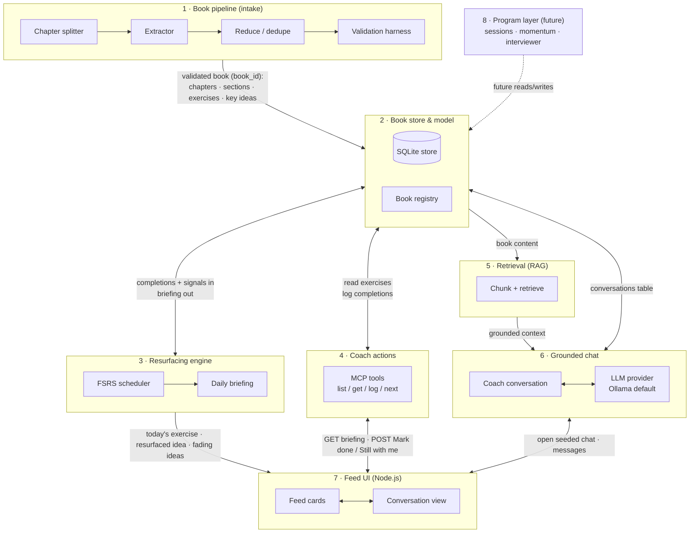
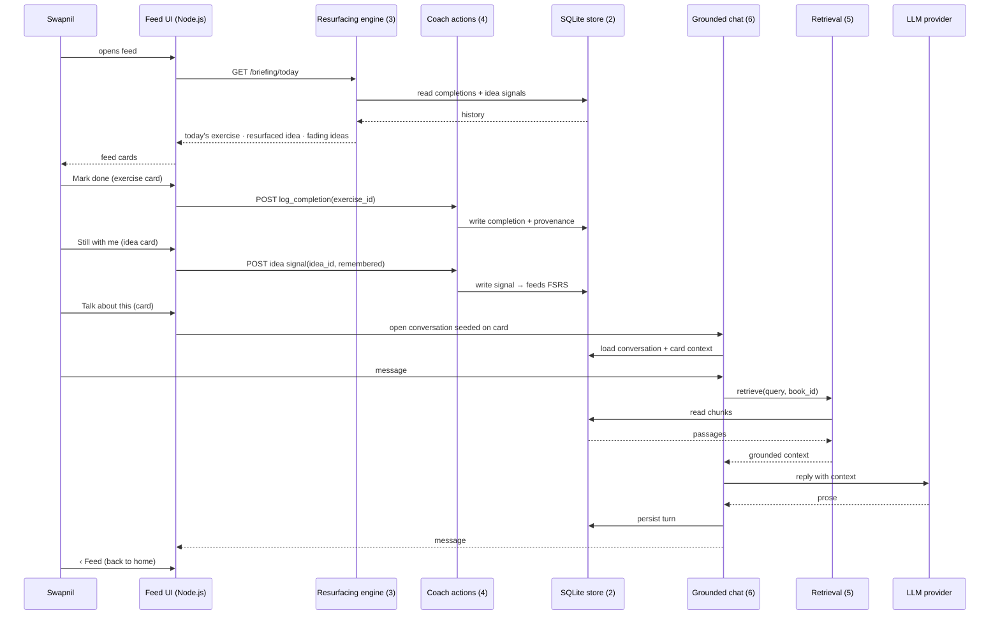

# Architecture

How LifeKit's pillars connect, and how data flows through them at runtime.

The pillar definitions live in the UI intent
(`../../intent/ui-feed-and-conversations.md`, Pillars section); this page draws
them. The contract behind every arrow: local-first, single user, localhost,
no auth / no cloud / no sync (A24). Deterministic runtime owns scheduling,
surfacing, and state; the LLM owns conversational prose.

## Pillar blocks and connections

Reading notes:

- The **store (2)** is the hub: every pillar reads from or writes to it, and
  nothing talks behind its back. That is what makes the pillars independently
  workable — each one's contract is "this shape in, that shape out" of the store.
- The **UI (7)** never touches scheduling or the LLM directly. It calls the
  briefing (3), the actions (4), and the chat (6) — the deterministic runtime
  owns all decisions.
- **Chat (6)** is a thin surface over retrieval (5) + the LLM: it adds
  conversation state and card seeding, not new knowledge.
- The **pipeline (1)** runs offline, before any of this. It never sees the
  user.

## Data flow: the daily loop

The observable loop from the intent — open feed, do the exercise, Mark done,
talk about it, start a chat, back to feed — wired end to end:

Design rules the wiring enforces:

- **No arrow from UI to LLM.** The UI never prompts the model directly; all
  prose goes through the chat pillar, which the runtime supervises.
- **No arrow from chat to scheduling.** A conversation can log what the user
  did (via coach actions), but it cannot change what resurfaces — only the
  FSRS engine decides that, from recorded signals.
- **Signals, not grades.** "Still with me" and completions flow into the
  store as plain facts; no probabilities or mastery states ever reach the UI.
